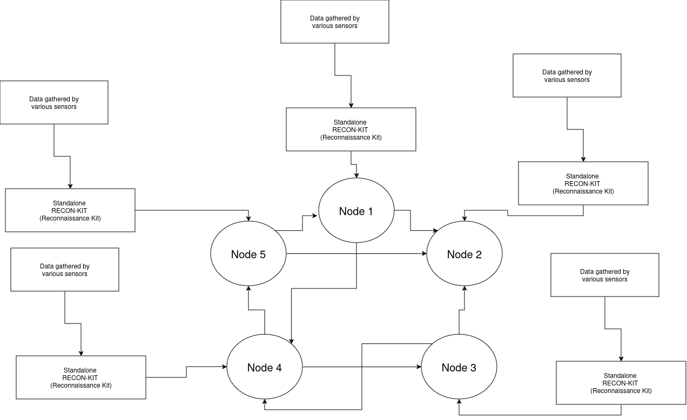
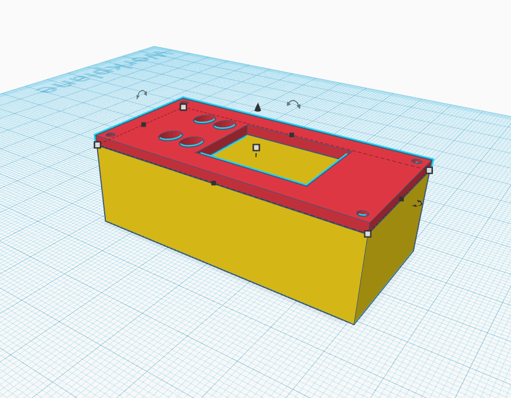
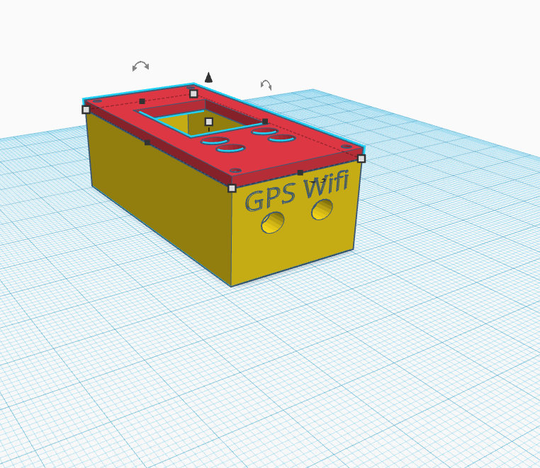
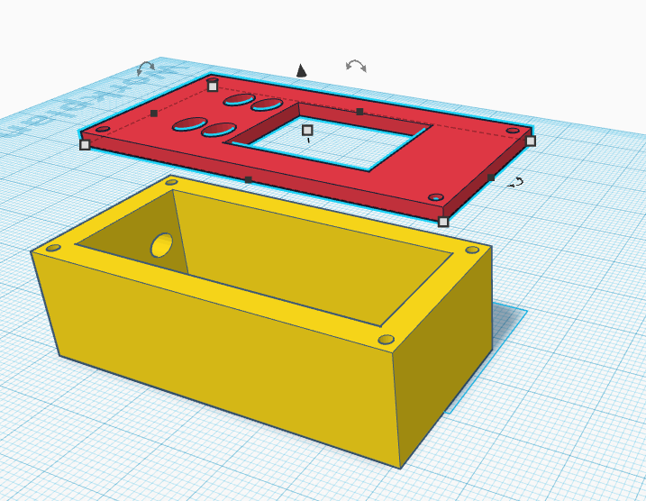
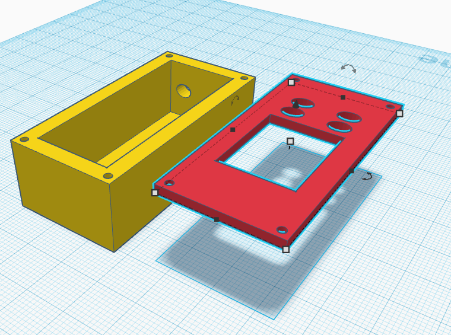
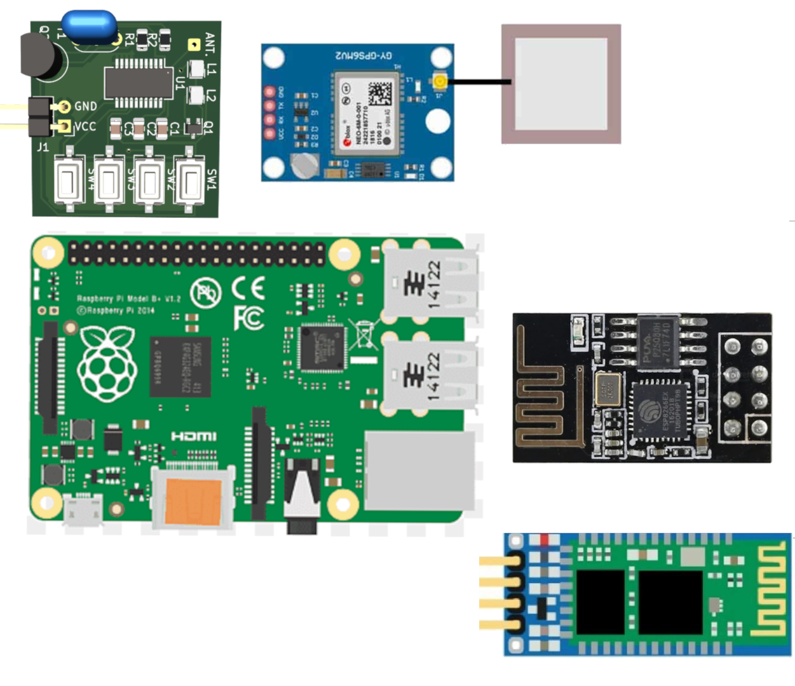

# RECON-KIT (Reconnaissance Kit)

## What is the RECON-KIT (Reconnaissance Kit)
---

It’s essentially a standalone device that can be easily attached to anything, from drones to cars, or even carried as a personal item. There are two versions of the kit: one is a cellphone app compatible with Android smartphones running Android 5 or above, and the other is an easy-to-assemble solder kit with 3D-printed parts including a custom phone case that is mountable.

## What does the RECON-KIT (Reconnaissance Kit) do?
---

Leveraging the variety of sensors installed in an Android smartphone, along with highly customizable modular electronic sensors, the device functions as a reconnaissance tool. Essentially, it acts as a reconnaissance drone, drawing inspiration from surveillance aircraft. Imagine the capabilities of a surveillance aircraft condensed into the form factor of a smartphone with easily swappable modular parts.

## Use for the RECON-KIT (Reconnaissance Kit)
---

Inspired by the concept of war driving—also known as access point mapping, which involves locating and exploiting connections to wireless local area networks (WLANs) while driving around a specific location—this approach is enhanced by incorporating military surveillance vehicles that scan and analyze radio waves. The device, which functions both as a stand-alone tool and as a smartphone app, is designed to analyze and map wireless data within a given area. This technology is particularly useful for professionals in cybersecurity, the military, and law enforcement, providing them with enhanced tactical awareness by identifying and understanding the wireless signals in their environment.

# The Stand Alone Kit
---
### Modular Parts that are in use

#### Data Gathering/Reconnaissance Parts

Common Wifi Module

**Modular Wifi Sensors**: 
The kit mostly consists of an ESP microchip for wireless communication, which can be used to capture Wi-Fi signals in an area. This is particularly useful for detecting different encryptions and security protocols on Wi-Fi networks. It can also help identify the presence of someone in what appears to be a rural or isolated area by detecting Wi-Fi signals. This capability can be further enhanced with signal boosters.

Wifi Booster (2.4GHz to 2.5GHz range)

**Wifi Booster Modules:** 
Wi-Fi booster modules can also be used in tandem with the stock Wi-Fi sensor/module, but they may drain the power pack of the standalone device more quickly. These boosters are effective in the 2.4GHz to 2.5GHz range. By using a directional antenna, such as a Yagi antenna, the signal can be further narrowed and focused, enhancing detection accuracy and range.

GPS Module

**GPS Module:** 
This is typically used to determine the current location of an object or the RECON-KIT (Reconnaissance Kit). GPS modules gather location data in different ways. Common or more affordable versions often use the triangulation method, which calculates a 'general location' rather than an exact pinpoint. In this method, the device scans for nearby cellphone towers and uses at least three of them to triangulate its general location. The more towers it can detect, the more precise the location becomes. Other GPS modules connect directly to a satellite, which can take 15 to 30 minutes or more, depending on the satellite's position. If the device loses power or its connection to the satellite, the location data it receives will be lost.

Bluetooth Module

**Bluetooth Module:** 
While not as powerful or long-range as Wi-Fi or radio, Bluetooth still has the capability to detect nearby devices. Since Bluetooth typically has higher transmit power when a device is close by, it can be easily detected.

Camera Module with IR (Infrared) Sensor

**Camera Module With IR Sensor:** 
This is usually intended for visual representation of the location of a specific standalone RECON-KIT (Reconnaissance Kit). It is preferable to use analog cameras rather than digital ones, even though analog cameras have lower quality and resolution. Analog cameras can withstand various weather conditions and can broadcast an image much farther than standard digital ones.

#### Data Transmission Parts

Radio Transmission Method Diagram

**Radio Transmission:**

Converting all the data gathered by sensors into a form of sound transmission—these sound transmissions could take the shape of SSTV (Slow Scan Television) or involve image processing that converts an image into sound to be decoded. Alternatively, the data could be transmitted similarly to how NOAA radio transmitters work, providing audio-generated data that dictates the current state of the device.

Client to Server Method Diagram

**Client to Server:**

If an internet connection is available, it's possible to send data through the internet to a remote server where the gathered data is stored. Cloud storage is not recommended because it is owned by private entities that can change their policies and potentially leak data to a threat actor.

Mesh Network Diagram

**Mesh Network Connection:**

A mesh network type of data transmission is ideal for scenarios where traditional communication channels are scarce, and no internet connectivity is available. This approach embodies the concept of decentralized communications, as there are no central servers to store or transmit data. Instead, data packets are stored and transmitted across nodes within the network. In this context, these nodes could be standalone devices such as the RECON-KIT (Reconnaissance Kit) or smartphones equipped with similar functionality. The strength of a mesh network lies in its distributed nature—the more nodes that are part of the network, the greater the coverage and data-gathering capabilities. These nodes can be strategically scattered across an open area, enabling them to communicate with one another in tandem, thus creating a robust and resilient communication network even in the absence of traditional infrastructure.

## Smartphone Version RECON-KIT (Reconnaissance Kit)
---
### App functions

**Using of GPS Sensors:** 
Smartphone GPS technology is far more robust than most freely available alternatives on the market. It's not new knowledge that many high-end GPS modules for certain embedded systems are derived from actual smartphones. These modules, like most high-end GPS systems, can also take 15 to 30 minutes to pair with a GPS satellite.

**Using of Camera:** 
It's going to be hardcoded that the use of the camera for the app will be particularly useful in any situation where the RECON-KIT (Reconnaissance Kit) is used.

**Using of GSM Module:** 
Sending data via SMS is a practical method for transmitting valuable information without relying heavily on internet connections. This approach can be particularly useful in situations where internet access is limited or unreliable, as SMS does not require a continuous connection and can operate on basic mobile networks.

**Sending data via internet:** 
If an internet connection is available, it's possible to send data through the internet to a remote server where the gathered data is stored. Cloud storage is not recommended because it is owned by private entities that can change their policies and potentially leak data to a threat actor.

# Mock-up and Prototype
---
### Mock-up APP

### Prototype Enclosure

### Stand-Alone Components

